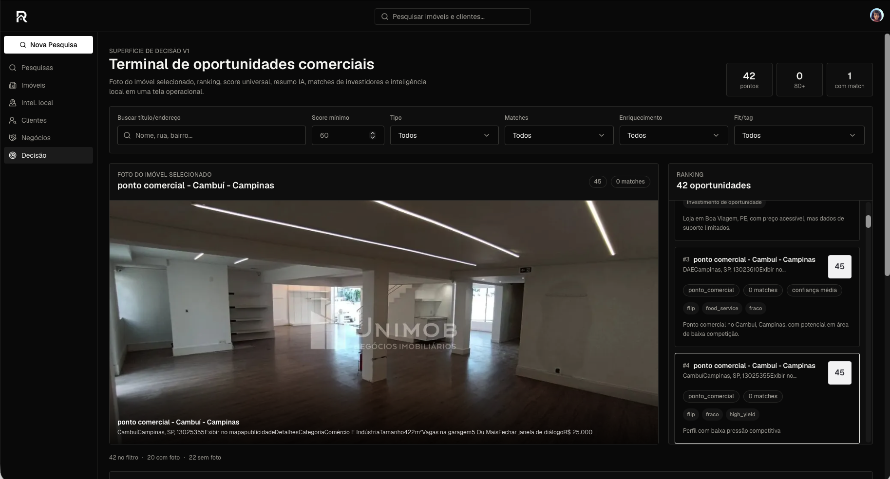

# RealTools

English · [Português](#português)

AI-powered deal management for commercial real estate brokers.

Solves deal rot — the dropped balls, missed follow-ups, and scattered data that happen when you manage acquisitions across spreadsheets, WhatsApp, and email.

[](LICENSE)
[](https://nextjs.org)
[](https://supabase.com)
[](https://vercel.com)

---



---

> "I used to lose deals in my inbox. Now I know exactly where every client is and which property fits them best."

> "The AI matching alone saved me 4 hours a week. I stopped manually comparing spreadsheets."

> "Finally a CRE tool that thinks like a broker, not an accountant."

---

## How It Works

The workflow is five steps. Each one does exactly one thing.

### 1. Import Properties

**Pesquisas → OLX import or manual add**

Search OLX by city, neighborhood, and keyword. RealTools scrapes the listings, classifies them as commercial or residential, and enriches each one with location intelligence — automatically.

Don't want to scrape? Add properties manually with photos, address, price, and description from the **Imóveis** tab.

### 2. Analyze

**Imóveis → property detail**

Every imported property gets:
- AI deal summary and investment angle
- Opportunity score by strategy (rental income, retail, logistics, flip)
- Location intelligence: demographics, nearby businesses, foot traffic profile
- Commercial classification confidence score

### 3. Build Client Profiles

**Clientes → investor profile**

Store each client's budget range, preferred neighborhoods, property types, investment strategy, and risk level. RealTools uses these to rank every property in your pipeline against every client — without you doing the math.

### 4. Match and Pitch

**Clientes → workspace → matches**

Open any client workspace to see their ranked matches, fit scores, and AI-generated pitch angles. Move deals through the pipeline: Sugerida → Enviada → Negociando → Fechada.

### 5. Track Deals

**Negócios → deal pipeline**

One view across all active negotiations. Every client, every property, every status — with notes and timestamps. Nothing falls through the cracks.

---

## Getting Started

```bash
git clone https://github.com/benirios/RealTools.git
cd RealTools
cp .env.example .env.local
npm install
npm run dev
```

You need:
- [Supabase](https://supabase.com) project (free tier works)
- [Clerk](https://clerk.com) account for auth
- [Vercel](https://vercel.com) for hosting (optional for local dev)

Run migrations:

```bash
npx supabase db push --linked
```

See [Environment Setup](#environment-setup) for the full variable list.

---

## Features

| Feature | What it does |
|---|---|
| OLX scraper | Import commercial listings by city, neighborhood, keyword |
| Manual listing | Add properties with photos, address, price, description |
| Source filter | View all, scraped-only, or manually-added listings |
| AI deal summary | Headline, investor angle, strengths, risks per property |
| Opportunity scoring | Score by rental income, retail, logistics, flip, own business |
| Location intelligence | Demographics, nearby businesses, area profile |
| Client matching | Rank every listing against every client's criteria automatically |
| Client workspace | Per-client pipeline with deal stages, notes, fit scores |
| Negócios pipeline | Cross-client deal view with status and timestamps |
| OM generation | Offering Memorandum creation and buyer tracking *(roadmap)* |

---

## Why It Works

Three things most real estate workflows get wrong:

**1. Data is scattered.** Properties in OLX, clients in WhatsApp, deals in spreadsheets. RealTools pulls everything into one place — scraped or manual, enriched automatically.

**2. Matching is manual.** Brokers mentally scan their client list every time a new property appears. RealTools scores every property against every client's strategy, budget, and neighborhood preferences in one pass.

**3. Nothing is verified.** "I sent that to João" is not a pipeline. RealTools tracks deal status, timestamps every action, and shows you exactly where each negotiation stands — so you close instead of chasing.

---

## Environment Setup

```bash
# Supabase
NEXT_PUBLIC_SUPABASE_URL=
NEXT_PUBLIC_SUPABASE_ANON_KEY=
SUPABASE_SERVICE_ROLE_KEY=

# Clerk
NEXT_PUBLIC_CLERK_PUBLISHABLE_KEY=
CLERK_SECRET_KEY=

# App
NEXT_PUBLIC_APP_URL=http://localhost:3000
```

---

## Tech Stack

| Layer | Technology |
|---|---|
| Framework | Next.js 15 (App Router) + TypeScript |
| Database | Supabase (Postgres + Storage + RLS) |
| Auth | Clerk |
| UI | TailwindCSS + shadcn/ui |
| Email | Resend |
| Hosting | Vercel |
| AI | Claude (Anthropic) |

---

## Roadmap

- [ ] Offering Memorandum (OM) generation + buyer tracking
- [ ] WhatsApp integration for deal updates
- [ ] CRM integrations (HubSpot, Pipedrive)
- [ ] Mobile application
- [ ] Multi-user / team collaboration
- [ ] Market intelligence and comparables
- [ ] Automated acquisition recommendations

---

## Troubleshooting

**Images not loading?** The proxy only allows OLX and Supabase Storage URLs. External image sources are blocked by design.

**Migration errors?** Run `npx supabase db push --linked` — migrations are idempotent.

**Auth redirect loops?** Check that `/om/*` and `/api/track/*` are excluded from the Clerk middleware matcher.

**Scrape returning nothing?** OLX blocks headless requests intermittently. Try a different `searchTerm` or reduce `maxListings`.

---

## Contributing

Open an issue before submitting a pull request for major changes.

Security issues: email directly, do not open a public issue.

---

---

## Português

Plataforma de gestão de negócios imobiliários comerciais com IA.

Resolve o problema do negócio perdido — a bola caída, o follow-up esquecido e os dados espalhados que acontecem quando você gerencia aquisições via planilha, WhatsApp e e-mail.

### Como Funciona

**1. Importar Imóveis** — Busque no OLX por cidade, bairro e termo. O RealTools raspa os anúncios, classifica e enriquece automaticamente. Ou adicione manualmente com fotos e descrição.

**2. Analisar** — Cada imóvel recebe resumo de negócio por IA, score de oportunidade por estratégia, e inteligência de localização.

**3. Cadastrar Clientes** — Perfil completo: orçamento, bairros preferidos, tipos de imóvel, estratégia e risco. O sistema ranqueia imóveis contra clientes automaticamente.

**4. Matchear e Apresentar** — Workspace por cliente com matches ranqueados, scores de aderência e ângulos de pitch gerados por IA.

**5. Acompanhar Negócios** — Uma visão de todos os negócios ativos: cliente, imóvel, status e anotações. Nada cai no esquecimento.
